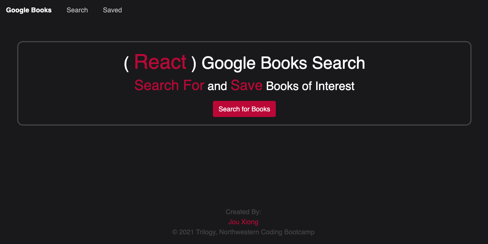
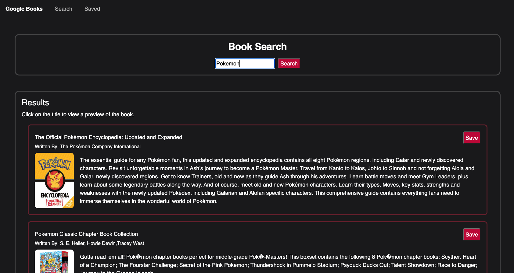
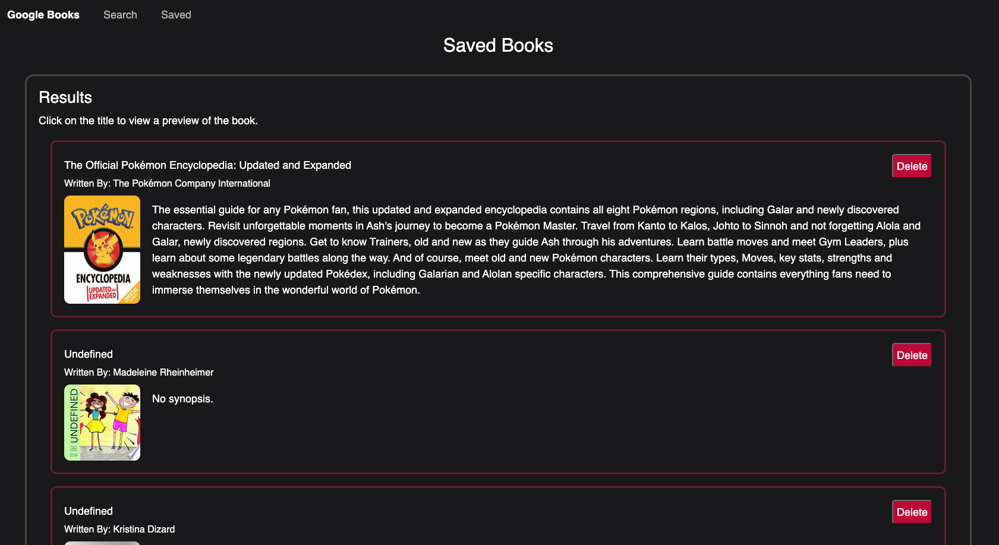

# 21-google-books

## Table of Contents
* [Introduction](#introduction)
* [Functionality](#functionality)
* [Tasks Completed](#tasks-completed)
* [Technologies Used](#technologies-used)
* [Installations](#installations)
* [Demo](#demo)
* [Known Issues](#known-issues)
* [Future Ideas](#future-ideas)
* [Sources](#sources)
* [License](#license)

 ## Introduction
Users can look up and save books.
* Deployed App: https://google-books-jx.herokuapp.com/
* GitHub: https://github.com/JXIong15/21-google-books

## Functionality
* When the user loads the page, they are shown a clickable navbar at the top of the page.
* Homepage displays the name of app and its purpose. User can click on the nav elements of the button on the homepage.
* On the Search page, user can search for a book by typing in the text box
    * Book results will display below
    * User can click on the title of the book to be taken to a book preview
    * User can save the book to their collection by clicking the `Save` button
* On the Saved page, all saved books by the user are displayed
    * If there are no saved books, then a message indicating that will show
    * User can click on the `Delete` button to remove the book from the Saved list
    * User can click on the title to view a preview of the book

## Tasks Completed
* Dowloaded necessary NPM packages with `npm install` on the Command Line
* Created `src` and necessary folders for development
* Created a server.js file to connect back-end and front-end
* Copied over routes, utils, models, and controllers from Week 21: Activity 5.
* Created a `React-Router nav` to display different pages.
* Created a header, footer, and body using React.
* In the src:
    * created a `Search` and `Saved` component
    * In the Search component:
        * created a form that returns the input value to the component
        * the value runs in an API query search to get the first 10 books with that input
        * books are mapped into a bookList array state, which is then passed to the `Results` page
        * created a click function that `posts` the targeted book to the database collection (also passed to the Results page)
    * In the Saved Component:
        * uses an API call that `gets` all the saved book from the database to pass to the Results page
        * created a Delete button that `removes` the targeted book from the database (also passed to the Results page)
    * In the Results page, the passed in array is mapped to the `Book` page
        * depending on which button function is passed in, that function and button label will be sent to Book as well
    * In the Book page, the individual books from the passed in array are rendered

 

## Technologies Used
* React
* NavLinks/Routers
* MongoDB
* Heroku

## Installations
* React-Router-Dom
* React
* Mongoose
* Axios

## Demo
* App Demo:

## Known Issues
* Some words don't search
* Heroku is slow to post

## Future Ideas
* allow for more than 10 search results by clicking on "See More" button at the bottom of results.

## Sources
* NPM Packages: https://www.npmjs.com/
* Heroku: https://www.heroku.com/
* React: https://reactjs.org/
* MongoDB Atlas: https://www.mongodb.com/

## License
Licensed under the [MIT License](LICENSE).

© 2021 Trilogy, Northwestern Coding Bootcamp

